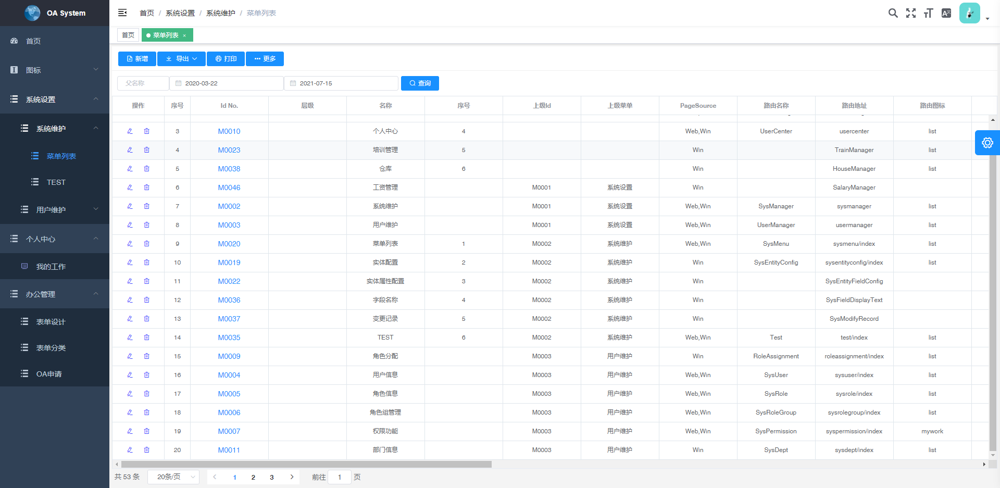
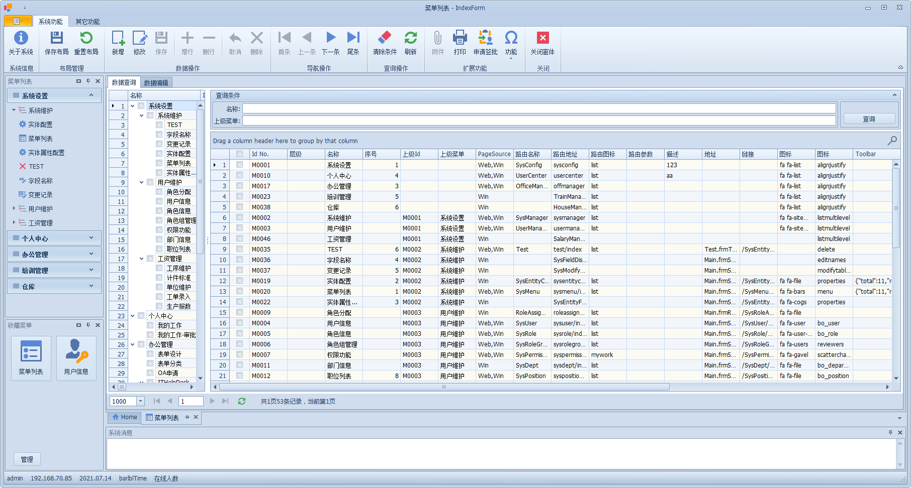

## 应用场景
> [!TIP|label:解读]
> - 项目使用`泛型基类`实现大部分标准功能，无需浪费时间和体力再去编写大量重复的代码，减轻开发者的工作量; 
> - 使用EF工具，自动生成SQL语句，让开发者更专注于业务代码的编写;   
> - 适用于企业的后台管理系统，使用本项目可以快速开发企业的后台管理系统;
## 项目结构
```text
└── XueQ
    ├── XueQ.Model                //模型层
        ├── Base                  //基类
        ├── Entity                //数据
        └── View                  //视图
    ├── XueQ.Service              //数据层
        ├── Base                  //基类
        ├── Config                //配置
        └── Context               //实现类DbContext
    ├── XueQ.Utility              //公共方法
    ├── XueQ.WebApi               //Api接口       
        ├── App_Start                //Mvc配置项
        └── Controllers            
            ├── Base              //基类
            └── Sys               //实现类
    ├── XueQ.CustControl          //自定义控件
    ├── XueQ.Win                  //Winform 程序
    ├── XueQ.AutoUpdate           //Winform 自动更新程序
    └── XueQ.WcfService           //Winform 服务端

```

## 主要模块
- Model
- [Service](xueq/service/readme.md?id=主要功能)
- Utility
- WebApi
- Win
- autoAupdate
- WcfService

## 基本功能
- 通用增删改查模块
- 动态拼接查询条件
- 通用权限管理
- 单个字段的修改记录
- OA审批流程

## 技术选型
- 花裤衩前端框架 [vue-element-admin](https://panjiachen.github.io/vue-element-admin-site/zh/)
-  DevExpress   WinForm
-  .Net MVC
-  Entity Framework  
-  AddFlow  流程图软件
-  MSSQL 


## 开发模式
- `B/S` -- 前后端分离模式
- `C/S` -- 直连模式

## 项目预览
  ***web界面***


 ***winform界面***

