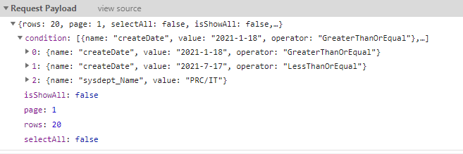
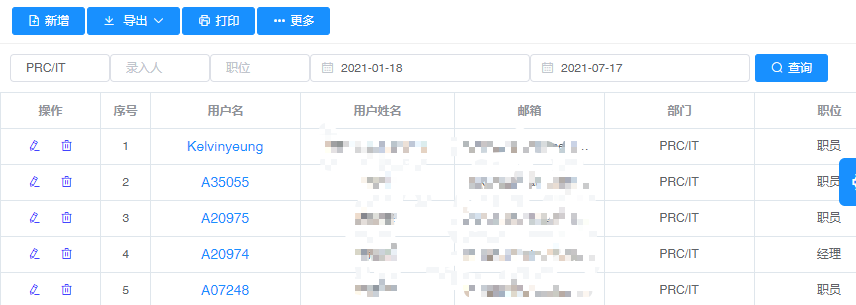

## 使用外键字段关联查询
> 需求:有两张表`SysUser`和`SysDept`，现在需要通过`部门名称`来查询出属于这个部门的所有用户
```cs
    public class SysUserEntity : Base.BaseEntity
    {
        public string Id { get; set; }
        public string Name { get; set; }    
        public int DeptId { get; set; }   
        public  SysDeptEntity SysDept { get; set; }     
    }
    public class SysDeptEntity : Base.BaseEntity
    {     
        public int Id { get; set; }
        public string Name { get; set; }  
    }
```
- 我们需要生成下面的SQL语句才能查询出想要的结果:
```sql
    SELECT * FROM dbo.SysUser AS A INNER JOIN dbo.SysDept AS B 
        ON A.DeptId=B.Id
        WHERE B.Name='PRC/IT'
```

- lambda表达式写法如下
```cs
    base.Db.SysUser.Where(n => n.SysDept.Name == "PRC/IT").ToList();
```

- 前端查询条件代码
  ```js
  <template v-slot:search>
      <el-input
        v-model="condition.sysdept_Name[0].value"
        placeholder="部门名称"
        style="width: 100px"
        size="mini"
      />
       <el-input
        v-model="condition.createBy[0].value"
        placeholder="录入人"
        style="width: 100px"
        size="mini"
      />
         <el-input
        v-model="condition.sysPosition_Name[0].value"
        placeholder="职位"
        style="width: 100px"
        size="mini"
      />
      <el-date-picker
        v-model="condition.createDate[0].value"
        type="date"
        placeholder="开始日期"
        value-format="yyyy-MM-dd"
        size="mini"
      >
      </el-date-picker>
      <el-date-picker
        v-model="condition.createDate[1].value"
        type="date"
        placeholder="结束日期"
        value-format="yyyy-MM-dd"
        size="mini"
      >
      </el-date-picker>      
    </template>   
  ```
- 后端代码,框架会自动帮我们生成lambda表达式
```cs
    public virtual ActionResult PostApiList()
    {            
        var model = Utility.Common.TransefRequestData<Models.Stand.QueryModel>(Request);
        var result = FilterList(model); ;
        return Json(result);
    }
```

- 拼接的查询条件和结果如下:
  


