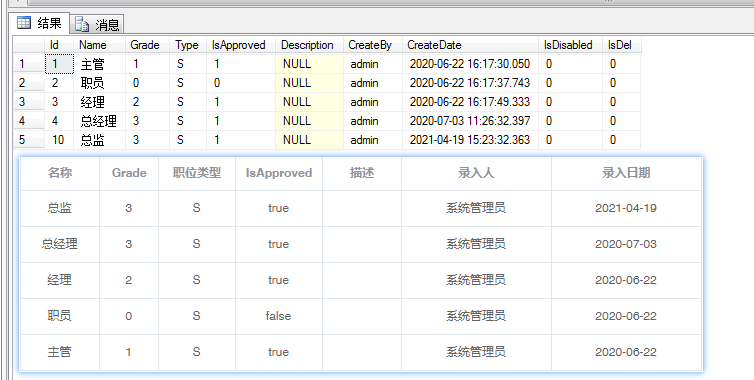

## 描述
   - 泛型基类,继承自`AbsService`重写部分方法和属性;    
   - 实现最基本的数据操作;
   - T类型参数:对应数据实体`Entity`
   - V类型参数:对应数据视图`View`
```cs
public abstract class BaseService<T,V>: AbsService,IService where T : class, new() where V : class, new()
{
     public BaseService()
      {            
          
      }
}
```

## ConStringName
- 默认值为是Default，可以在实现类的构造函数里修改连接名称
```cs
protected ConStringName ConStringName = ConStringName.Default;
```

## DefualtQuerySort
- 默认值为主键降序,可以在实现类的构造函数里添加排序字段
```cs
private QuerySort _defualtQuerySort { get; set; }
protected QuerySort DefualtQuerySort
{
    get
    {
        if (this._defualtQuerySort == null)
        {
            this._defualtQuerySort = new QuerySort();
        }
        return this._defualtQuerySort;
    }
}
protected QuerySort GetDefualtQuerySort 
{ 
    get 
    { 
        return DefualtQuerySort??(DefualtQuerySort= new QuerySort().Add(ModelConfig.KeyName, SortEnum.Desc)); 
    } 
}
public SysMenuService()
{   
    base.DefualtQuerySort.Add(nameof(SysMenuEntity.FatherId), Stone.AQH.SortEnum.Aesc);  
}
```

## DefualtQueryCondition
- 默认查询条件，可以在实现类的构造函数添加具体条件
  

```cs
private QueryCondition _defualtQueryCondition { get; set; }
protected QueryCondition DefualtQueryCondition
{
    get
    {
        if (this._defualtQueryCondition == null)
        {
            this._defualtQueryCondition = new QueryCondition();
        }
        return this._defualtQueryCondition;
    }
}
public SysMenuService()
{       
    base.DefualtQueryCondition.Add(nameof(SysMenuEntity.IsDevelop), false);    
}
```

## ModelConfig
- 通过提取EFConfig，获取实体配置,取得`主键名`、`外键名`等等信息
```cs
public override DbModelConfig ModelConfig { get { return Db.Extensions().ModelConfig<T>(); } }
```

## EntityFieldConfig
- 实体字段配置,通配置可以设置用户对字段的权限`只读`、`可见`、`必填`等等
```cs
private List<XueQ.Model.View.SysEntityFieldConfigView> _entityFieldConfig;
public override List<XueQ.Model.View.SysEntityFieldConfigView> EntityFieldConfig
{
    get { return _entityFieldConfig ?? (_entityFieldConfig = GetEntityFieldConfig()); }
}
protected virtual List<SysEntityFieldConfigView> GetEntityFieldConfig()
{
    var result = new SysEntityFieldConfigService().SelectList(n => n.MName.Equals(this.EType.Name));
    this.User?.SetEntityPermission(result);
    return result;
}
```

## GetThisPrimaryKeyVal
- 取主键值
```cs
public object GetThisPrimaryKeyVal()
{
    if (this.Current==null)
    {
        return null;
    }            
    return this.Current.Extensions().GetValue(ModelConfig.KeyName);
}      
public object GetThisPrimaryKeyVal(object entity)
{           
    return entity.Extensions().GetValue(ModelConfig.KeyName);
}
```

## 子类公共方法
- 一些对数据操作最基本的方法，只能在子类里使用
```cs
protected int Add(T t)
{
    Db.Set<T>().Add(t);
    return Db.SaveChanges();
}
protected T GetOne(params object[] keys)
{
    return Db.Set<T>().Find(keys);
}
protected int Remove(T t)
{
    Db.Set<T>().Remove(t);
    return Db.SaveChanges();
}
protected virtual int Remove(object Id)
{
    var t = GetOne(Id);
    Db.Set<T>().Remove(t);
    return Db.SaveChanges();
}
protected IQueryable<T> QWhere(Expression<Func<T, bool>> where = null)
{
    if (where == null)
    {
        return Db.Set<T>();
    }
    return Db.Set<T>().Where(where).AsQueryable();
}
protected IQueryable<T> QWhereCondition(Expression<Func<T, bool>> where = null)
{
    var queryable = QWhere(where);
    if (this.User != null)
    {
        //获取数据权限
        var dataPoint = EntityFieldAttInfo.FirstOrDefault(n => n.IsDataPoint);
        if (dataPoint != null)
        {
            var values = dataPoint?.DataPointValues;
            queryable = queryable.Contains(dataPoint.Name, values);//添加数据权限，此处为包含查询in(1,2,3)
        }
        this.ResetViewOwn();//重设私有数据的权限
        //IsViewOwn=true时只能查询私有数据,默认筛选条件为CreateBy
        if (this.IsViewOwn && this.User.IsSuperAdmin == false)
        {
            string field = "CreateBy";
            var viewOwnName = EntityFieldAttInfo.FirstOrDefault(n => n.IsViewOwnName);
            if (viewOwnName != null) field = viewOwnName.Name;           
            this.DefualtQueryCondition.Add(field, this.User.Id);                  
        }               
    }
    queryable = queryable.Where(this.DefualtQueryCondition);
    return queryable;
}
protected IQueryable<T> QWhereConditionJoin(Expression<Func<T, bool>> where = null)
{
    var result = this.QWhereCondition(where);

    return result.Join<T>();//添加关联查询
}
```


## SelectOne方法

- 查询单个视图  
- 通过主键、lambda表达式查询，返回`View`类型

```cs
public virtual V SelectOne(object id)
{
    var result = QWhereCondition().Where(ModelConfig.KeyName, id.ToString());            
    return result.Select<T, V>().FirstOrDefault();
}
public virtual V SelectOne(Expression<Func<T, bool>> where = null)
{
    return QWhereCondition(where).Select<T, V>().FirstOrDefault();
}

```

## SelectList方法

- 查询视图集合   
- 通过`lambda`表达式或者`QueryCondition`添加查询条件,返回`View`类型

```cs
public virtual List<V> SelectList(Expression<Func<T, bool>> where = null,bool replace=true)
{
    if (replace)
    {
        return QWhereCondition(where).Select<T, V>().ReplaceUserId(this);
    }
    return  QWhereCondition(where).Select<T, V>().ToList();
}
public virtual List<V> SelectList(QueryCondition condition)
{
    var result = QWhereCondition().Where(condition);
    return result.Select<T, V>().ReplaceUserId(this);
}
 public virtual List<V> SelectList(QueryCondition condition, QuerySort sort)
{
    var result = QWhereCondition().Where(condition).OrderBy<T>(sort);
    return result.Select<T, V>().ReplaceUserId(this);
}
```
> [!TIP|label:ReplaceUserId作用]
> - 将查询结果的Id替换成Name返回给UI来显示;  
> - 下图展示了数据库中的`CreateBy`字段的值为`admin`，替换之后前端显示为`系统管理员`:



## SelectPagedList方法
- 分页查询视图集合   
- 通过`QueryCondition`添加查询条件,返回`View`类型
  
  ```cs
  public virtual List<V> SelectPagedList(ref long total, int startIndex, int count, QueryCondition condition, QuerySort sort)
  {
      if (!sort.HasData()) sort = new QuerySort().Add(ModelConfig.KeyName, SortEnum.Desc);
      var queryable = QWhereConditionJoin().Where(condition);
      var result = queryable.OrderBy(sort).Page(startIndex, count);
      total = queryable.Count();
      return result.Select<T, V>().ReplaceUserId(this); 
  }
  ```

  ## SelectComboBox方法
- 查询下拉框数据
- 返回值`ComboBoxData`
```cs
public virtual List<ComboBoxData> SelectComboBox(string value , string text= null)
{
    text = text ?? value;
    var propertyNames = new List<string>() { text, value };
    var returnNames = string.Format("{0}:id,{1}:text", value, text);
    var result = QWhereCondition().GroupBy<T, ComboBoxData>(propertyNames, returnNames).Select(n => n.Key).ToList();
    return result;
}
public class ComboBoxData
{
    public string Id { get; set; }
    public string Text { get; set; }
    public string Value { get { return this.Id; } }
    public bool Selected { get; set; }
}   
```


## Validate方法
- 更新时对数据进行有效性验证,全局虚方法，可根据业务需求Override
```cs
 protected virtual void Validate(MethodType method, BindingList<T> bindlist, ExecuteResult eResult, ServiceArgs svcArgs)
{
    switch (method)
    {
        case MethodType.Save:            
            var listinfo = bindlist.Extensions<T>().GetObjectInfos();
            var notNullFields = EntityFieldConfig.Where(n => n.ClassType.Equals("E") && n.IsNull == false && n.IsVisibled).ToList();
            foreach (var item in notNullFields)
            {                
                var result = listinfo.Any(n => n.Where(x => x.Name.Equals(item.Name)).FirstOrDefault().IsEmpty);
                if (result)
                {
                    eResult.Msg = string.Format("{0}不能为空", item.NameStyle);
                    eResult.ExecuteValue = true;
                    eResult.State = ExecuteState.warning;
                    break;
                }
            }          
            break;
        case MethodType.Delete:         
            break;
    }

    //判断单据是不是已经申请签批
    if (this.IsMaster && svcArgs.IsAddNew == false)
    {
        var svcname = this.GetType().Name;
        var tasksvc = new WorkFlowTaskService();
        var keyval = this.GetThisPrimaryKeyVal();
        var istask = tasksvc.IsProcessing(svcname, keyval.ToString());
        if (istask)
        {
            eResult.Msg = string.Format("{0}不能进行修改", "单据已经申请签批");
            eResult.ExecuteValue = true;
            eResult.State = ExecuteState.warning;
        }
    }
}
```

## WriteModifyRecord方法
> 保存时对更新字段添加修改记录

```cs
protected virtual void WriteModifyRecord(MethodType m, TrackerValueCollection trackervalues)
{
    
    if (m == MethodType.Delete) return;           
    var configs = this.ChildServices.SelectMany(n => n.EntityFieldConfig).ToList();
    configs.AddRange(this.EntityFieldConfig);        

    List<SysModifyRecordEntity> modifys = new List<SysModifyRecordEntity>();
    foreach (var item in trackervalues)
    {
        var modify = new SysModifyRecordEntity();
        modify.TableName = item.TableName;
        modify.KeyVal = item.KeyVal;
        modify.ColName = item.Name;
        modify.ColCaption = configs.FirstOrDefault(n => n.MName.Equals(item.EntityName) && n.Name.Equals(item.Name))?.NameStyle;
        modify.NewValue = item.CurrentValue;
        modify.OldValue = item.OriginalValue;
        modify.CreateBy = this.Db.User?.Id;
        modify.CreateDate = DateTime.Now;
        modifys.Add(modify);
    }
    new SysModifyRecordService().AddRange(modifys);

}
```

## SaveUploadFile方法

- 保存附件信息,附件只保存不删除。

```cs
protected virtual void SaveUploadFile()
{
    if (this.UploadFile.IsNullOrEmpty()==false)
    {                
        new SysUploadFileService().SaveUploadFile(this.UploadFile, this.GetType().Name, GetThisPrimaryKeyVal());
    }
        
}
```