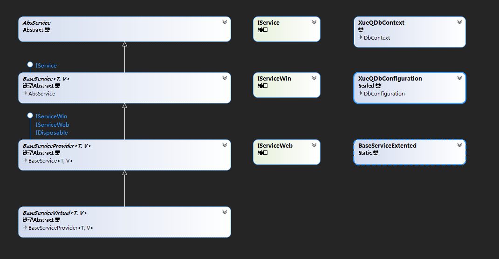

### 实现功能
> - 通用的增删改查，数据验证，分页查询；
> - 支持主从表、一对多关系的`增删改查`;
> - 保存单个字段的修改记录;
> - 动态查询条件的拼接;
> - 通过`BindingSource`进行数据绑定，winform 程序可以直接使用`BindingSource`双向绑定数据;

### 主要基类
> [!TIP|label:所有基类都是抽象类]

 -  `AbsService`
  - `BaseService`
 - `BaseServiceProvider`
  - `BaseServiceVirtual`

### 基类关系

