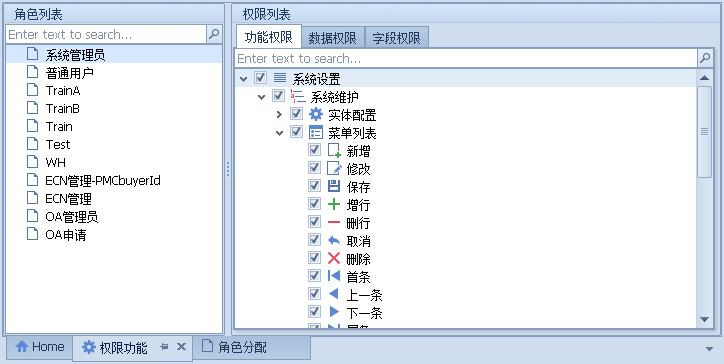
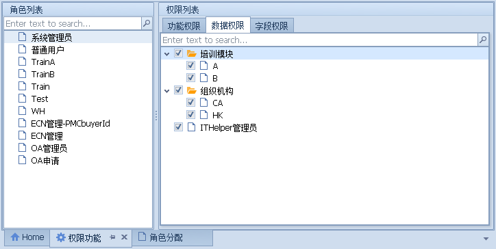
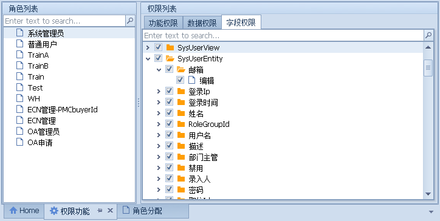
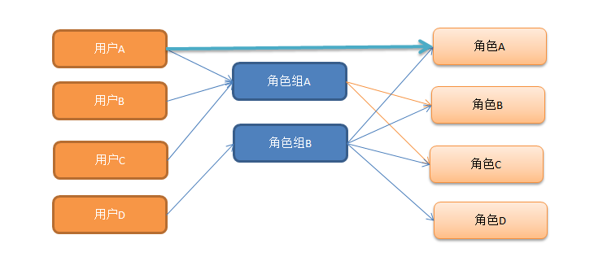
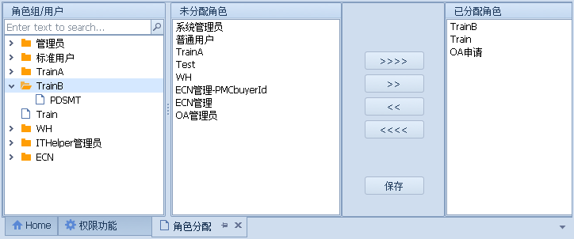

## 权限设计
> [!Tip|label:基于角色的权限管理]

- 权限模块主要由`权限点`、`角色`、`用户`三部分组成;
- 权限点则划分为`功能权限`、`数据权限`、`字段权限`三种类型;
- 功能权限即设置角色对某个功能操作的限制，可分别控制角色查看、修改、新增、删除、打印、禁用等操作
  

 - 数据权限即设置角色查看的数据范围,如A用户不能看B用户的数据。
  

 - 字段权限即可设置角色查看的字段范围，如某些用户不能查看单价信息。
  

## 角色赋权类型
> [!Tip|label:加减权限]
> 可以给角色赋权设置为加或者是减，在用户获取权限的时候进相应该的赋权运算就行了。  
> 应用场景，如可以设置某个角色不能查看单价，赋权时进行Remove运算。

## 用户与权限关系图
- 可以为用户设置相应的角色组来分配权限;
- 也可以单独为用户分配具体的角色;
- 两种分配权限的方式是可以叠加的;  

## 角色分配页面

