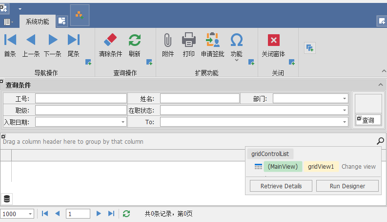
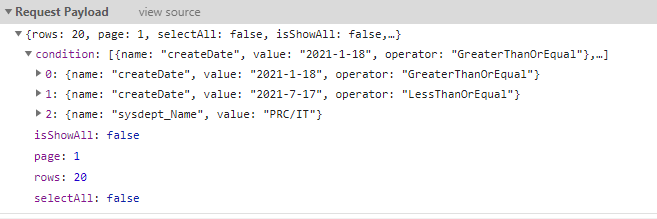
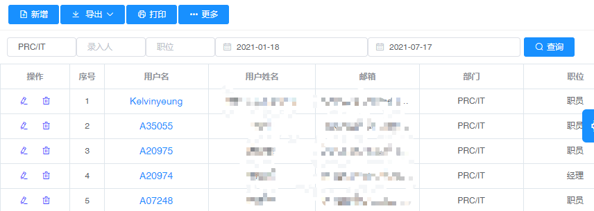

## 基本功能
> [!Tip|label:第三方组件]
> 这里使用的是一个第三方的组件
- 查询条件容器;
- 支持分组添加;
- 类型自动转换;

```cs
public class QueryCondition
{
    public QueryCondition();
    public QueryCondition(string value, object value);
    public QueryCondition(string value, object value, string value);
    public QueryCondition(string value, object value, ArithmeticOperator value);

    public bool HasData { get; }
    public List<string> Names { get; }
    public int Count { get; }

    public QueryCondition Add(QueryCondition condtion);
    public QueryCondition Add(string name, object value);
    public QueryCondition Add(string name, object value, string arithmetic);
    public QueryCondition Add(string name, object value, ArithmeticOperator arithmetic);
    public QueryCondition Add(ConditionExpression exp, int index = 0);
    public QueryCondition AddInQuery(string name, params object[] value);
    public ConditionExpression SetExpressionLogical(string name, LogicalOperator logical, int index = 0);
    public ConditionGroup SetGroupLogical(int index, LogicalOperator logical);
    public SqlParameter[] ToSqlParameter();
}
```

## Add方法
- 支持链式编写
> 参数1：字段名, 参数2：字段值, 参数3：运算符
```cs
var condition = new QueryCondition();
condition.Add("PositionId", 3).Add("CreateBy", "admin").Add("SysDept_Name", "IT", "Contains");        
var result = base.SelectList(condition);
```
等效以下lambda表达式
```cs
var result = base.SelectList(n => n.PositionId == 3 && n.CreateBy == "admin" && n.SysDept.Name.Contains("IT"));
```
等效以下SQL语句
```sql
SELECT * FROM dbo.SysUser AS A INNER JOIN dbo.SysDept AS B
ON A.DeptId=B.Id
WHERE A.PositionId=3 
AND A.CreateBy='admin'
AND B.Name LIKE '%IT%'
```


## AddInQuery方法
- 包含查询
> 参数1：字段名, 参数2：`object`数据
```cs
var condition = new QueryCondition();
condition.AddInQuery("DeptId", "13", "14", 15);
var result = this.Db.SysUser.Where(condition);
```
等效以下lambda表达式
```cs
var deptIds = new int[] { 13, 14, 15 };
var result = this.Db.SysUser.Where(n => deptIds.Contains(n.DeptId)).ToList();
```
等效以下SQL语句
```sql
SELECT * FROM dbo.SysUser WHERE DeptId IN (13,14,15)
```


## 拼接动态查询条件
> [!Tip|label:web条件拼接]
> 构建默认条件实体，动态添加条件集合,以`Json`格式提交到服务端查询
- 前端代码
```js
export function defaultQueryParams(){
    return {
        rows:20,
        page:1,
        selectAll:false,//选择所有数据
        isShowAll:false,//显示所有字段
        condition:[],//发送给服务器的条件        
        queryCondition:{},//查询条件,动态条件id:[{name:'id',value:'admin'}]
        totalPages:0,  //页面总数       
    }    
}
export function resolverQueryParams(params) {    
    let query = JSON.parse(JSON.stringify(params));//深拷贝对象
    let condition=[]    
    if (query.queryCondition) {
        if(query.queryCondition.constructor === Object){
            condition=resolverQueryCondition(query.queryCondition)
        }      
        query.condition = condition;        
    }    
    delete query.queryCondition;  
    delete query.totalPages;    
    return query;
}
function resolverQueryCondition(obj){
    let condition = [];      
    Object.keys(obj).forEach(key => {    
      condition.push(...obj[key])
    }); 
    let result=condition.filter(n=>{    
        return isEmpty(n.value)==false
    })
    return result;
}
```
- 后端代码,解析`Json`格式添加到`QueryCondition`条件容器
  
```cs
public static Stone.AQH.QueryCondition ResolverCondition(string jcondition)
{
    if (string.IsNullOrEmpty(jcondition)) return null;
    var jarr = JArray.Parse(jcondition);           
    var listExp = jarr.ToObject<ICollection<Stone.AQH.EvalCondition.ConditionExp>>().ToList();            
    var condition = new Stone.AQH.QueryCondition();
    foreach (var n in listExp)
    {
        if (n.Value.IsNullOrEmpty()) continue;               
        if (n.Arithmetic!=null)
        {
            condition.Add(n.Name, n.Value, n.Arithmetic);
        }
        else
        {
            condition.Add(n.Name, n.Value);
        }                
    }
    return condition;
}     
```

----
> [!Tip|label:win条件拼接]
> 在控件的Tag属性添加Name，默认是Contains匹配查询  
> 可以根据业务需求改变,用英文","进行分隔
- C# 代码片段
```cs
protected QueryCondition BuildCondition()
{
    this.Condition = new QueryCondition();
    if (this.ConditionControl != null)
    {
        foreach (Control c in this.ConditionControl.Controls)
        {
            if (c.Tag != null && !string.IsNullOrEmpty(c.Text))
            {
                var arithmetic = Stone.AQH.CommonExtend.InterceptByCharAfterString(c.Tag.ToString(), ",");
                if (string.IsNullOrEmpty(arithmetic))
                {
                    this.Condition.Add(c.Tag.ToString(), c.Text, nameof(Stone.AQH.ArithmeticOperator.Contains));
                }
                else
                {
                    var name = Stone.AQH.CommonExtend.InterceptByCharBeforeString(c.Tag.ToString(), ",");
                    this.Condition.Add(name, c.Text, arithmetic);
                }
            }
        }
    }
    return this.Condition;
}
```

- 控件代码,设置Tag属性
```cs 
this.editorEmployeeInfoViewEmpNo.Tag = "EmpNo";
this.editorEmployeeInfoViewEmpName.Tag = "EmpName,Equal";
this.editorEmployeeInfoViewDeptName.Tag = "DeptName";
this.editorEmployeeInfoViewCaste.Tag = "Caste";
this.editorEmployeeInfoViewEmpStatus.Tag = "EmpStatus";
this.editorEmployeeInfoViewInDateF.Tag = "InDate,GreaterThanOrEqual";
this.editorEmployeeInfoViewInDateT.Tag = "InDate,LessThanOrEqual";
```

- 设计窗体预览
  
  


  ## 使用外键字段关联查询
> [!NOTE|label:Examples]
> 当前有两张表`SysUser`、`SysDept`，它们之间通过`DeptId`进行关联;  
> 现在需要通过`部门名称`来查询出属于这个部门的所有用户?
```cs
    public class SysUserEntity : Base.BaseEntity
    {
        public string Id { get; set; }
        public string Name { get; set; }    
        public int DeptId { get; set; }   
        public  SysDeptEntity SysDept { get; set; }     
    }
    public class SysDeptEntity : Base.BaseEntity
    {     
        public int Id { get; set; }
        public string Name { get; set; }  
    }
```
- 我们需要生成下面的SQL语句才能查询出想要的结果:
```sql
    SELECT * FROM dbo.SysUser AS A INNER JOIN dbo.SysDept AS B 
        ON A.DeptId=B.Id
        WHERE B.Name='PRC/IT'
```

- lambda表达式写法如下
```cs
    base.Db.SysUser.Where(n => n.SysDept.Name == "PRC/IT").ToList();
```

- 前端查询条件代码
  ```js
  <template v-slot:search>
      <el-input
        v-model="condition.sysdept_Name[0].value"
        placeholder="部门名称"
        style="width: 100px"
        size="mini"
      />
       <el-input
        v-model="condition.createBy[0].value"
        placeholder="录入人"
        style="width: 100px"
        size="mini"
      />
         <el-input
        v-model="condition.sysPosition_Name[0].value"
        placeholder="职位"
        style="width: 100px"
        size="mini"
      />
      <el-date-picker
        v-model="condition.createDate[0].value"
        type="date"
        placeholder="开始日期"
        value-format="yyyy-MM-dd"
        size="mini"
      >
      </el-date-picker>
      <el-date-picker
        v-model="condition.createDate[1].value"
        type="date"
        placeholder="结束日期"
        value-format="yyyy-MM-dd"
        size="mini"
      >
      </el-date-picker>      
    </template>   
  ```
- 后端代码,框架会自动帮我们生成lambda表达式
```cs
    public virtual ActionResult PostApiList()
    {            
        var model = Utility.Common.ResolverRequest<Models.Stand.QueryModel>(Request);
        var result = FilterList(model); 
        return Json(result);
    }
```

- 拼接的查询条件和结果如下:
  


