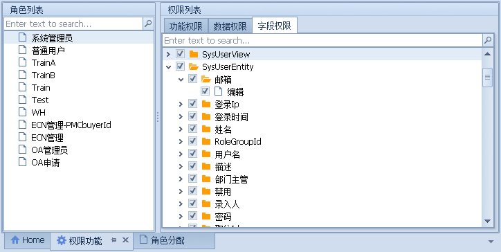

## 开始使用
列如添加一个`SysUser`表到框架中，只需要按以下步骤进行操作即可实现最基本的功能。

## 1. 新建实体
> 在Model项目里新建Entity和View实体，并且要继承Base基类。
- Entity对应数据中实体表，所以必须与数据库中的字段一样，否则运行时会报错。
- View就好比是数据库里的视图，在这里我们只需要定义在框架中，而不需要在数据库里定义视图了。
1. 新建`SysUserEntity`，包含3个外键表`SysRole`|`SysDept`|`SysPosition`
   > [!TIP]
   > 外键实体可以根据业务的需要添加`Virtual`关键字
```csharp
public class SysUserEntity : Base.BaseEntity
    {
        public string Id { get; set; }
        public string Name { get; set; }
        public string Password { get; set; }
        public int DeptId { get; set; }
        public int PositionId { get; set; }
        public int RoleGroupId { get; set; }
        public bool IsDeptHead { get; set; }
        public string Email { get; set; }
        public string Description { get; set; }
        public string LastLoginIp { get; set; }
        public DateTime? LastLoginDate { get; set; }

        public string CreateBy { get; set; }
        public DateTime CreateDate { get; set; }
        public bool IsDisabled { get; set; }
        public bool IsDel { get; set; }       
        public  SysRoleGroupEntity SysRoleGroup { get; set; }
        public  SysDeptEntity SysDept { get; set; }
        public virtual SysPositionEntity SysPosition { get; set; }      
    }
```
1. 新建`SysUserView`,视图应是`扁平化`的，只定义需要的外键表字段即可： 
   > [!TIP]
   > 定义`SysDeptEntity`外键实体`Name`字段，框架会根据定义自动映射：
   >   1. 外键实体名_字段名(`SysDept_Name`) 
   >   2. 通过添加标记(`MappedName`(`"SysDept.Name"`))
```csharp
 public class SysUserView : Base.BaseView
    {       
        public string Id { get; set; }
        public string Name { get; set; }
        [Stone.AQH.Attribute.IgnoreMapped]
        [JsonIgnore]
        public string Password { get; set; }
        public int? DeptId { get; set; }
        public int? PositionId { get; set; }
        public int? RoleGroupId { get; set; }
        public bool IsDeptHead { get; set; }
        public string Email { get; set; }
        public string Description { get; set; }
        public string LastLoginIp { get; set; }
        public DateTime? LastLoginDate { get; set; }
        public string CreateBy { get; set; }        
        public DateTime CreateDate { get; set; }
        //[JsonConverter(typeof(BoolConvert))]
        public bool IsDisabled { get; set; }
       
        public bool IsDel { get; set; }

        public bool IsSuperAdmin { get; set; }
        [JsonIgnore]
        public bool IsSuperLeader { get; set; }     

        [MappedName("SysDept.Name")]
        public string DeptName { get; set; }
        [MappedName("SysPosition.Name")]
        public string PositionName { get; set; }
        public int SysPosition_Grade { get; set; }
        [MappedName("SysRoleGroup.Name")]
        public string RoleGroupName { get; set; }
       
    }
```

## 2. 添加EF配置
> 在Service项目里添加实体的`SysUserConfig`配置，继承`EntityTypeConfiguration`基类
- 传入泛型参数`SysUserEntity`

```csharp
public class SysUserConfig : EntityTypeConfiguration<SysUserEntity>
    {
        public SysUserConfig()
        {
            this.ToTable("SysUser");
            this.HasKey<string>(k => k.Id);
            //SysUserEntity必须有SysRoleGroup，一个SysRoleGroup有很多的SysUserEntity，他们使用RoleGroupId做外键
            this.HasRequired(c => c.SysRoleGroup).WithMany().HasForeignKey(e => e.RoleGroupId).WillCascadeOnDelete(false);
            this.HasRequired(c => c.SysDept).WithMany().HasForeignKey(e => e.DeptId).WillCascadeOnDelete(false);
            this.HasRequired(c => c.SysPosition).WithMany().HasForeignKey(e => e.PositionId).WillCascadeOnDelete(false);
        }
    }
```

## 3. 添加DbContext
> 在Service项目里添加`SysUserService`,并继承`BaseServiceVirtual`基类;
> - 通过继承，子类拥有父类的一切属性和行为
- 传入泛型参数`SysUserEntity`和`SysUserView`
- 在构造函数中设置连接名称

```csharp
 public class SysUserService : Base.BaseServiceVirtual<SysUserEntity, SysUserView>
    {
        public SysUserService()
        {
            base.ConStringName = XueQ.Model.XEnum.ConStringName.Web;
        }
    }
```

## 4. 添加Controller
> 在MVC项目里添加`SysUserController`,继承`BaseSvcController`。
> - 由于之前的项目用的是.Net Mvc的框架，就不在新建新的Api项目，直接修改了原有的框架，添加相应Api接口操作数据。
- 添加SysUserService字段,运行时框架会自动实例化
```csharp
 public class SysUserController : Base.BaseSvcController
    {
        public Service.Context.SysUserService Svc;      
        public SysUserController()
        {
           
        }
    }    
```

## 5. Api接口
> 经过以上几个步骤后我们就拥有了Base基类的所有功能了，如果你不需要进行复杂的业务逻辑，那么通过以下Api接口就可以对表进行`增删改查`操作了。

| 接口名 | 描述 |
|:----|---|
|  List   |获取对象集合|
|  AddNew   |新增|
|  Edit   |编辑|
|  Delete   |删除|
|  SelectComboBox   |获取下拉集合数据|
|  ColConfig   |获取字段配置|
|  WriteToolbar   |写入工具栏|
|  ExportExcel   |导出Excel|


```js
import request from '@/utils/request'
export function getCol(svcname, params) {
  return request({
    url: `/${svcname}/ColConfig`,
    method: 'get',
    params
  })
}
export function getList(svcname, params) {
  return request({
    url: `/${svcname}/list`,
    method: 'get',
    params
  })
}

export function postList(svcname, data) {
  return request({
    url: `/${svcname}/list`,
    method: 'post',
    data
  })
}
export function getAddNew(svcname, params) {
  return request({
    url: `/${svcname}/AddNew`,
    method: 'get',
    params
  })
}
export function postAddNew(svcname, data) {
  return request({
    url: `/${svcname}/AddNew`,
    method: 'post',
    data
  })
}
export function postEdit(svcname, data) {
  return request({
    url: `/${svcname}/Edit`,
    method: 'post',
    data
  })
}
export function getEdit(svcname, id) {
  const params = { id: id }
  return request({
    url: `/${svcname}/Edit`,
    method: 'get',
    params
  })
}
export function postDelete(svcname, data) {
  return request({
    url: `/${svcname}/Delete`,
    method: 'post',
    data
  })
}
export function postWriteToolbar(svcname, data) {
  return request({
    url: `/${svcname}/WriteToolbar`,
    method: 'post',
    data
  })
}
export function postExportExcel(svcname, data) {
  return request({
    url: `/${svcname}/ExportExcel`,
    method: 'post',
    data,
    responseType: 'blob'
  })
}
export function getComboBox(svcname, id,name) {
  const params = { id: id,name:name }
  return request({
    url: `/${svcname}/SelectComboBox`,
    method: 'get',
    params
  })
}
```

## 6.配置实体字段
- 可以分别设置Entity和View实体;
  > View实体作用是展示数据，可以设置字段Visible，字段名等; 
  > Entity实体对应的是数据表，可以设置字段的有效性验证，必填等;


## 7.分配权限

- 为角色分配权限



## 8.添加菜单
- 添加菜单并配置路由参数和winform程序的地址


## 9.添加Web页面
- 前端vue框架会根据菜单的路由参数动态添加路由;
- 在views文件里添加对应的页面，并引入mixin基类模块;
  > 设置svcname="SysUser",查询条件可以根据需要自行添加
- 基类模块会根据字段配置自动生成视图列表和编辑页面;
- 要自定义页面使用插槽即可;
  
```js
<template>
  <bs-list-main ref="bslistmain">
    <template v-slot:search>
      <el-input
        v-model="condition.sysdept_Name[0].value"
        placeholder="部门名称"
        style="width: 100px"
        size="mini"
      />
       <el-input
        v-model="condition.createBy[0].value"
        placeholder="录入人"
        style="width: 100px"
        size="mini"
      />
         <el-input
        v-model="condition.sysPosition_Name[0].value"
        placeholder="职位"
        style="width: 100px"
        size="mini"
      />
      <el-date-picker
        v-model="condition.createDate[0].value"
        type="date"
        placeholder="开始日期"
        value-format="yyyy-MM-dd"
        size="mini"
      >
      </el-date-picker>
      <el-date-picker
        v-model="condition.createDate[1].value"
        type="date"
        placeholder="结束日期"
        value-format="yyyy-MM-dd"
        size="mini"
      >
      </el-date-picker>      
    </template>   
  </bs-list-main>
</template>
<script>
import svcmixin from "@/components/BaseForm/mixins/svc.js";
const custTools = [];
export default {
  name: "SysUser",
  mixins: [svcmixin], 
  data() {
    const defCondition = {
      createDate: [
        {
          name: "createDate",
          value: this.getDate(-180),
          operator: "GreaterThanOrEqual",
        },
        {
          name: "createDate",
          value: this.getDate(),
          operator: "LessThanOrEqual",
        },
      ],
      sysdept_Name: [{ name: "sysdept_Name", value: "" }],
      sysPosition_Name:[{name:'sysPosition_Name',value:'',operator:'Contains'}]
    };
    return {
      svcname: "SysUser",
      previewVisible:false,
      custTools,
      defCondition,     
    };
  }, 
};
</script>
```

- 视图页面预览


- 编辑页面预览
  > 标准的编辑页面自带附件模块


## 10.添加Winform页面

- 新建`frmSysUser`窗体文件,并添加以下代码

```cs
public partial class frmSysUser : BaseModules.FormsRib.BaseFormViewEditUI
    {
        public XueQ.Service.Context.SysUserService Svc;

        public frmSysUser()
        {
            InitializeComponent();
        }
        protected override void RegisterData()
        {
            base.ViewProvider = BaseModules.FormComponents.BuilerProvider.BuildList(Svc);
            base.EditProvider = BaseModules.FormComponents.BuilerProvider.BuildEdit(Svc);
            base.RegisterData();
        }
        protected override void AfterServiceStart()
        {           
            Utility.DevExpressHelper.XEditor.FillLoolupEdit(this.editorSysUserEntityDeptId, Svc.GetComboBoxData().SysDept());

            Utility.DevExpressHelper.XEditor.FillLoolupEdit(this.editorSysUserEntityPositionId, Svc.GetComboBoxData().SysPosition());           

            Utility.DevExpressHelper.XEditor.FillLoolupEdit(this.editorSysUserEntityRoleGroupId, Svc.GetComboBoxData().SysRoleGroup());
           
            this.gridViewEdit.Columns[nameof(SysUserEntity.RoleGroupId)].ColumnEdit = Utility.DevExpressHelper.XEditor.RepositoryLookupEdit(Svc.GetComboBoxData().SysRoleGroup());

       
            this.gridViewEdit.Columns[nameof(SysUserEntity.DeptId)].ColumnEdit = Utility.DevExpressHelper.XEditor.RepositoryLookupEdit(Svc.GetComboBoxData().SysDept()); 

            this.gridViewEdit.Columns[nameof(SysUserEntity.PositionId)].ColumnEdit = Utility.DevExpressHelper.XEditor.RepositoryLookupEdit(Svc.GetComboBoxData().SysPosition()); 
        }

        protected override void ToolBarClick(string name, ref bool re)
        {
            base.ToolBarClick(name, ref re);

            if (name==nameof(barbtnUpdateDomain))
            {
                Utility.ShowBox.ShowWaitForm(this, () => { new XueQ.Service.Context.SysDomainUserService().UpdateUser(); });
               
            }
        }
    }
```

- 视图页面
  
  

  - 编辑页面 

  